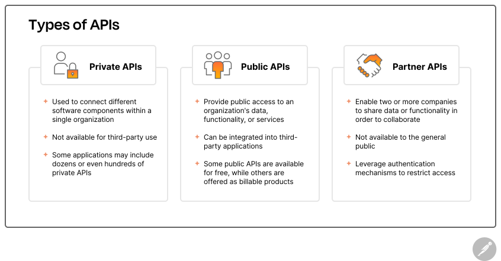

# API (Applicaion programming interfact)

**What is an API?**

It is set of principles and protocols that enable different software components
to commnunicate and tranfer data. Developers use this to brdige the gap b/w
different distinct chunck of codes.

**How does APIs work?**

APIs work by sharing data b/w applications, systems, and devices. This happens
through a request and response cycle. The request is sent to the API, which
retrieves the data and returns it to the user.

1. API client: responsible for starting the conversation by sending the request.
Can be triggered by user or by external events.

2. API requests: An API request will look and behave differently depending on 
the type of API, but typically include the following components:
	* Endpoint: An API endpoint is a dedicated URL that provides access to 
	specific resources. For instance, the /articles endpoint in a bloggin app
	would include the logic for processing all requests that are related to 
	articles.
	* Method: request's method indicates the type of operation the client would
	like to perform on a given resources. 
	HTTP methods: [Http method](https://blog.postman.com/what-are-http-methods/)
	* Parameters: Parameters are the variables that are passed to an API 
	endpoint to provide specific instructions for the API to process. These
	parameters can be included in the API request as part of the URL, in the
	query string, or in the request body.
	* Request headers: Request headers aer key-value pairs that provide extra
	details about the request, such as its content type or authentication creds.
	* Request body: The body is the main part of the request, and it includes 
	the actual data that is required to create, update, or delete a resource. 

3. API server: The API client sends the request to the API server, which is 
responsible for handling authentication, validating input data, and retrieving
or mainpulating data.

4. API response: Finally, the API server sends a response to the client. The API
response typically includes the following components:
	* Status Code: HTTP status codes are the 3 digit codes that indicate the 
	outcome of an API request. Example: 200 - ok; 201 - created - 404 - not 
	found.
	* Response headers: HTTP response headers are very similar to request header
	, except they are used to provide additional information about the server's
	response.
	* Response body: The repsonse body includes the actual data or content the
	client asked for - or an error message if something went wrong.

**What are benefits of APIs?**

APIs connect various software systems, applications, and devices for allowing
them to communicate with one another. Benefits: Automation, Innovation, Security
, and Cost Efficiency.

**What are the different types of APIs?**

There are many different types of APIs and ways to categorize them.
* Private APIs: used to connect within a single organization, and not available
for third-party use.
* Public APIs: provide access to an organization's data, functionality, or 
services, which third party developers can integrate into their own applications
. Some are billable and some are free.
* Partner APIs: Enable two companies to share data or functionality in order to
collaborate on a project. Not available to public, hence leverage auth mechanism
to ensure they are only used by authorized partners.

**What are the most common API architectural styles?**

You can categorize APIs according to their architecture style. The most 
frequently used architectural styles are:

1. **REST** : The most popular for transfering data over internet. In a RESTful
context, resources are accessible via endpoints, and operations are performed on
those resources with standard HTTP methods such as GET, POST, PUT, and DELETE.

2. **SOAP** : stands for Simple Object Access Protocol, uses XML to transfer
highly structured messages b/w a client and server. SOAP is often used in 
enterprise environment of legacy systems, and while it includes advanced 
securty features, it can be slower than other API architectures.

3. **GraphQL** : open source query language that enables clients to interact
with a single API endpoint to retrieve the exact data they need, without 
chaining multiple requests together. This approach reduces the number of round
trips between the client and server, which can be useful for applications that
may run on slow or unreliable connections.

4. **Webhooks**: used to implement event-driven architectures, in which requests
are automatically sent in response to event-based triggers. For instance, when a
specific event occurs in an application, such as a payment being made, the app
can send an HTTP request to a pre-configured webhook URL with the relevant event
data in the request payload. The system that receives the webhook can then 
process the event and take the appropiate action.

5. **gRPC**: RPC stands Remote Procedure Call, and gRPC APIs were originated in
Google. In this architecture, a client can call on a server as if it were a 
local object, which makes it easier for distributed apps and systems to communi-
cate with one another.

**What are some common API use cases?**

1. Integrating with internal and external systems.
2. Adding or enhancing functionality.
3. Connecting IoT devices.
4. Creating more scalable systems.
5. Reducing costs
6. Improving organizational security and governance.

